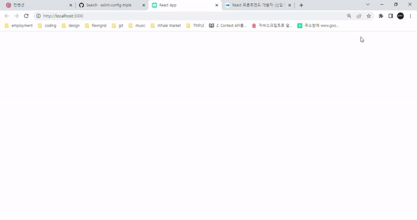

# Triple-FE-Assignment



<br/>

## 개발환경

| type |    version    |
| :--: | :-----------: |
|  OS  | Windows11 X64 |
| Node |    16.14.0    |
| Npm  |     8.3.1     |

<br/>

## 프로젝트 실행방법

1. Project Clone

```
$ git clone https://github.com/rapidmon/tripleassignment
```

2. Dependencies Install

```
$ npm i
```

4. Running Mode

```
$ npm start
```

<br/>

## 폴더구조

```bash
src
 ┣ assets
 ┃  ┣ badge-apple4x.png
 ┃  ┣ play-store2x.png
 ┃  ┣ triple-guide-section-1.gif
 ┃  ┗ triple2x.png
 ┣ components
 ┃  ┣ Awards
 ┃  ┃  ┣ award.js
 ┃  ┃  ┗ index.js
 ┃  ┣ MainImg
 ┃  ┃  ┗ index.js
 ┃  ┗ Title
 ┃     ┣ content.js
 ┃     ┣ emphasis.js
 ┃     ┗ index.js
 ┣ hook
 ┃  ┗ useCountup.js
 ┣ lib
 ┃  ┣ constants.js
 ┃  ┗ util.js
 ┣ page
 ┃  ┗ Section.js
 ┣ theme
 ┃  ┗ fadeIn.js
 ┣ App.js
 ┣ global.css
 ┗ index.js

```

<br>

## 사용한 기술과 선택한 이유

<p>
  
  
  
  
  
</p>

- Styled-components : JS와 CSS사이의 상수와 함수를 쉽게 공유할 수 있기 때문에 채택하여 사용하게 되었습니다. 인터랙션이 늦어지는 단점이 있긴 하지만 본 과제와 같이 작은 규모에서는 크게 영향이 없을 것이라고 생각했습니다.
- Prettier : 일관성 있는 코드 스타일을 위해 예전부터 사용해 왔던 Prettier를 사용했습니다.

<br/>

## 구현 애니메이션

<br/>

### 영역별 등장 애니메이션

- 좌측 이미지, 지표 문구, 수상 내역 순으로 100ms 간격을 두고 살짝 위로 떠오르는 듯한 애니메이션을 구현했습니다.
- styled 컴포넌트의 keyframe을 이용하여 구현했습니다.

### 숫자가 올라가는 애니메이션

- 각 숫자는 0부터 시작합니다.
- setInterval을 사용하여 세 숫자 모두 2초 동안 증가하고 끝납니다. 다만 Math.round로 인한 차이가 약간씩 나는게 아쉽습니다.
- easeOutExpo util을 사용해 증가 속도가 느려지는 효과를 구현했습니다.

<br>

## 에러

<br/>

### clearInterval 오류

progress === 1 이라고 생각해서 1을 true로 해주었는데, 생각대로 작동하지 않았습니다. 그래서 원래대로 progress === 1 로 코드를 고쳐주었습니다.
